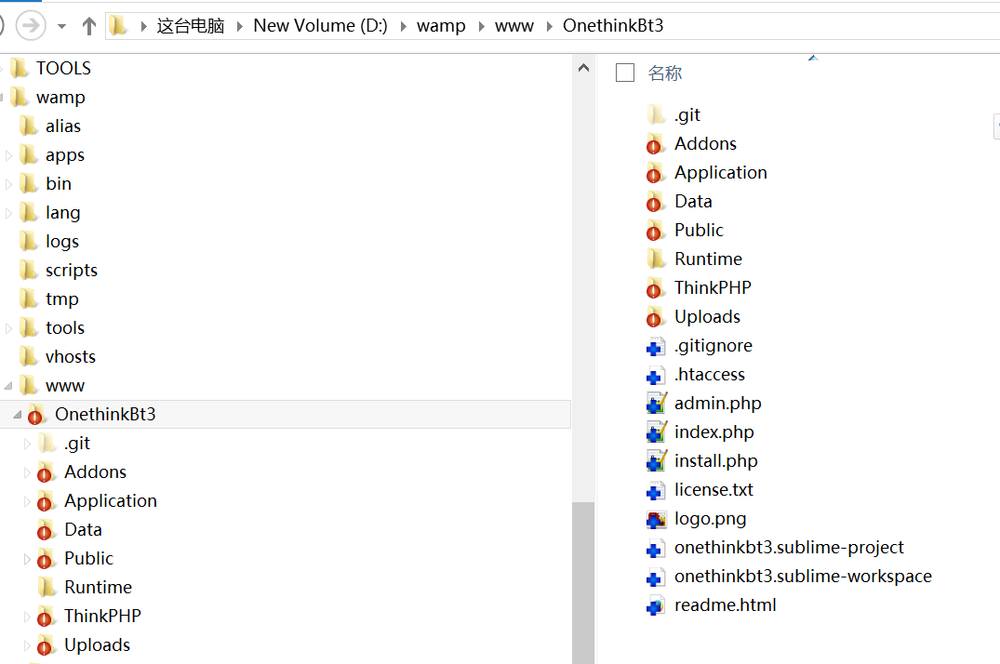
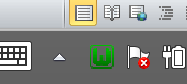
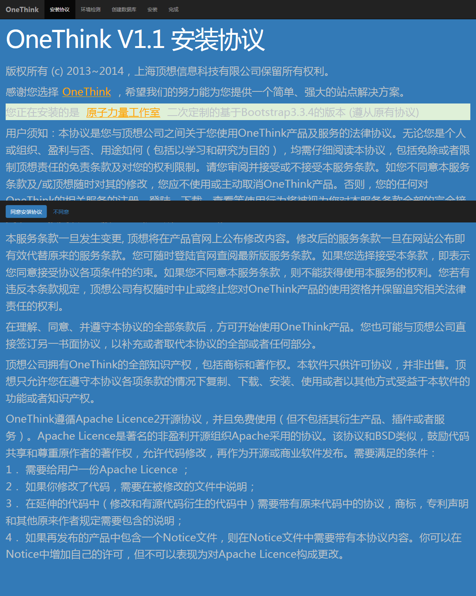
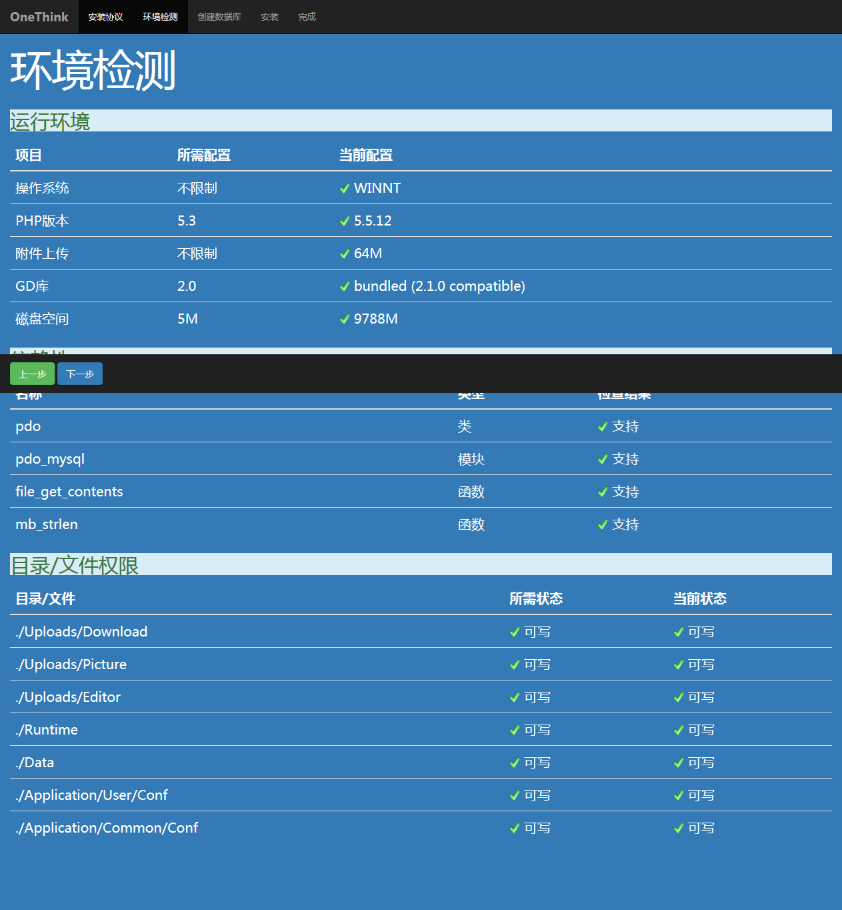
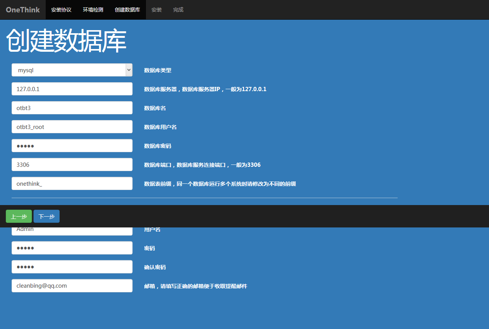

# Installation and configuration instructions
## Local Server Config
1. Install `wampserver2.5-Apache-2.4.9-Mysql-5.6.17-php5.5.12-64b` to `D:\wamp`
2. Install `Firefox 38.0.5`
3. clone repo to `D:\wamp\www\OnethinkBt3`

## Create Database and Add User 

**If you have configured the root user and root password, you can install it directly with the root user. You don't need this step.**

Click Wamp icon with left button - MySQL -> MySQL console, directly press enter when prompt password (the root user does not have a password when wamp is just installed , if you changed the root password, please enter your own password)
```sql
create database otbt3;
create user otbt3_root@localhost identified by 'otbt3';
use mysql;
select user,host,password from user where user='otbt3_root'; --Verify that the user was created successfully
GRANT ALL PRIVILEGES ON otbt3.* TO otbt3_root@localhost IDENTIFIED BY 'otbt3' WITH GRANT OPTION;
flush privileges;
```
## Install this version
1. Start wamp and make sure the tray is green in the lower right corner of desktop

1. Open the browser and enter `localhost/onethinkbt3/install.php` or `localhost/onethinkbt3`,appears this

 
3. Click【**同意安装协议**】，Ensure all tests pass

 
4)	Click【**下一步**】,condig as follows:数据库密码otbt3，Admin密码admin（Can be modified according to your needs）


5.If everything is correct, the installation process is fast

 
